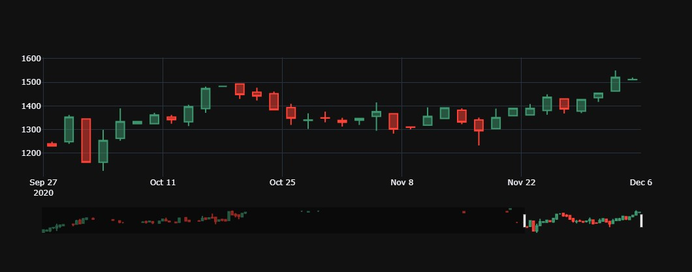
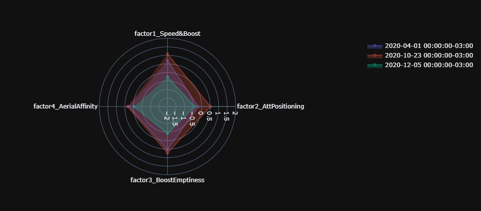
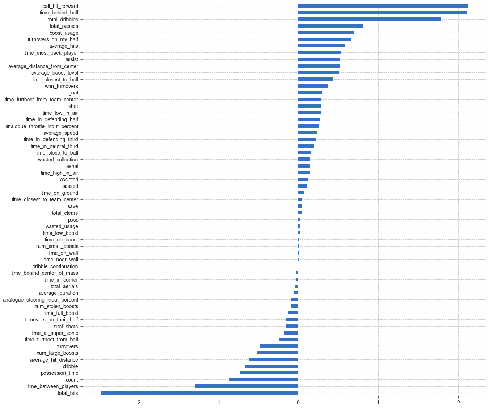
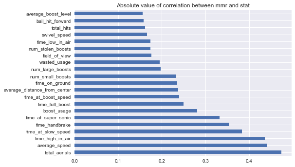

# Rocket-League-Replay-ML-&-Analysis

In this project I read replay data from Calculated.gg and perform Data Analysis on my own gameplay as well as create a machine learning model that predicts mmr based on gameplay tendencies in order to evaluate my performance.

Sadly, Calculated.gg has been discontinued, so I'm in the process of changing the code to read the data from either locally saved replays or ballchasing.com, and it's currently non-functional.

## Some charts
### MMR interactive candlestick chart:

### Radar Plot days comparison:

### Feature importances of model to predict wins:

### Correlation between stats and mmr (EDA for MMR model):

